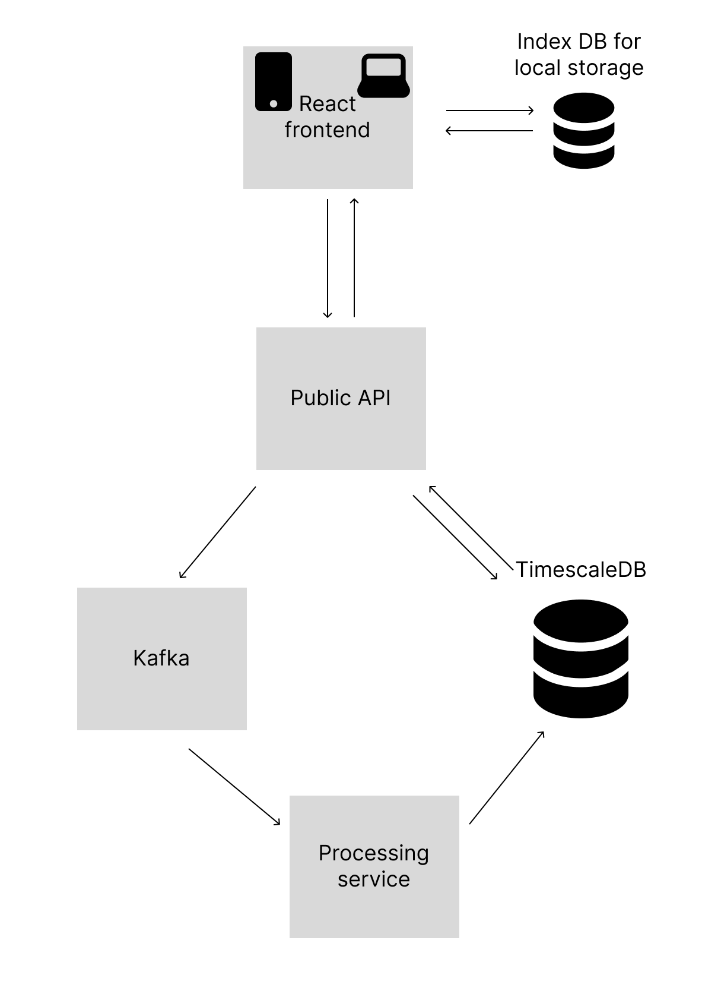

# Gaze PWA Monorepo

This project is a monorepo containing a full-stack web application for gaze tracking and analysis. It uses Docker Compose to orchestrate all services for local development and deployment.

---

## Infrastructure



The above diagram illustrates the architecture of the Gaze PWA system, showing how the React frontend communicates with the backend services, data flow through Kafka for real-time processing, and storage in both local IndexedDB and TimescaleDB.

---

## Design Choices

### Database

We want a highly scalable datastore for time series data. We want to be able to query individuals and sessions with high performance. This querying leans me towards SQL-like databases. To allow for high amounts of scalability, we can use something like TimescaleDB on top of postgres which is ideal for time series data at scale.

The processed data we are storing has the following columns:

- `session_id` UUID
- `user_id` UUID
- `timestamp_ms` BIGINT
- `gaze_x` FLOAT
- `sampling_rate` INTEGER
- `calibration_params` FLOAT[3]
- `device` TEXT
- `velocity` FLOAT
- `is_anomaly` BOOLEAN

### Visualisations

I used D3.js to give us maximum flexibility to customise visualisations and interactivity going forward. This is a far better solution than many off-the-shelf libraries.

### Data Streaming

I have created a kafka streaming service to allow us to process a large amount of data in a distributed manner in case our activity suddenly increases.

### Separate Service for Processing Data

As this may become heavier over time, I decided to make this its own service to ensure any heavy tasks do not affect our public facing API. This decoupling also allows us to scale up this specific service in case the load increases.

### Things Left to Do

- Bring all secrets and env variables to an `.env` file which is imported into docker-compose
- Use kubernetes for deployment if we want multi-node deployments (easy task)
- Currently, the user data is uploaded to the public API which then sends it to the processing engine. This engine calculates and stores the velocity data and the validity of the data using a hardcoded velocity metric. We should decide on the best method for anomaly detection. We could potentially use a neural network here or stick to simple heuristics that exclude extreme values.
- Make visualisations nicer
- Note that we still perform some of the derived calculations (velocity and movement frequency) on the frontend as these have not been updated to query the data saved by the processing engine yet.
- Testing for buggy behaviour. Sometimes the user can create duplicate inputs by repeatedly pausing and restarting the recording.
- Handle missing data. I've currently attached the frame rate onto every single row so we can remove data that does not meet the minimum standard. Possible ideas for small patches of missing data could include using the last available record as a guide for the missing data.
- Authentication
- Cleaning up the frontend code
- Use typescript for increased safety, developer productivity and improved context for LLM assistance

---

## Services Overview

### 1. **frontend**

- **Location:** `./frontend`
- **Description:** React-based Progressive Web App (PWA) for gaze data collection, calibration, and visualization. Uses Vite for development and hot reloading.
- **Dev Port:** [http://localhost:5173](http://localhost:5173)

### 2. **fastapi**

- **Location:** `./backend/fastAPI`
- **Description:** FastAPI backend for receiving, storing, and serving gaze data. Connects to TimescaleDB for storage and Kafka for messaging.
- **Port:** [http://localhost:8000](http://localhost:8000)

### 3. **timescaledb**

- **Description:** PostgreSQL-compatible time-series database for storing gaze and processed data. Initialized with `init.sql` for schema and user setup.
- **Port:** 5434 (host) → 5432 (container)

### 4. **kafka**

- **Description:** Message broker for streaming and processing gaze data in real time.
- **Port:** 9092

### 5. **processing-service**

- **Location:** `./backend/processing-service`
- **Description:** Python service for consuming gaze data from Kafka, performing processing/analysis, and writing results back to TimescaleDB.
- **Port:** 8001

---

## Prerequisites

- [Docker](https://www.docker.com/get-started) and [Docker Compose](https://docs.docker.com/compose/) installed

---

## Setup & Running the App

1. **Clone the repository:**

   ```sh
   git clone https://github.com/Amirjab21/eye-tracker-for-PD
   cd gaze-pwa
   ```

2. **Start all services with Docker Compose:**

   ```sh
   docker-compose up --build
   ```

   - The first run may take a few minutes to build images and initialize the database.

3. **Access the app:**
   - **Frontend:** [http://localhost:5173](http://localhost:5173)
   - **Backend API (FastAPI):** [http://localhost:8000/docs](http://localhost:8000/docs) (Swagger UI)

---

## Environment Variables

- The frontend uses `VITE_BACKEND_URL` to know where to send API requests. This is set in `docker-compose.yml` for Docker, or in `.env` for local dev.
- The backend services use environment variables for database and Kafka connection details (see `docker-compose.yml`).

---

## Troubleshooting

- **Database errors:** If you change the database schema or user, you may need to remove the Docker volume to re-initialize:
  ```sh
  docker-compose down
  docker volume rm gaze-pwa_timescale_data
  docker-compose up --build
  ```
- **Frontend not hot reloading:** Ensure you are running the Vite dev server (not Nginx) and that the volume mount is set up in `docker-compose.yml`.
- **API requests fail with `net::ERR_NAME_NOT_RESOLVED`:** Make sure your frontend is configured to use `http://localhost:8000` for API calls, not the Docker service name.

---

## Stopping the App

To stop all services:

```sh
docker-compose down
```

---

## Directory Structure

```
gaze-pwa/
  backend/
    fastAPI/           # FastAPI backend
    processing-service/# Data processing service
    init.sql           # Database schema and user setup
  frontend/            # React PWA frontend
  docker-compose.yml   # Orchestration config
```

---

## Contact

For questions or issues, please open an issue in this repository.
